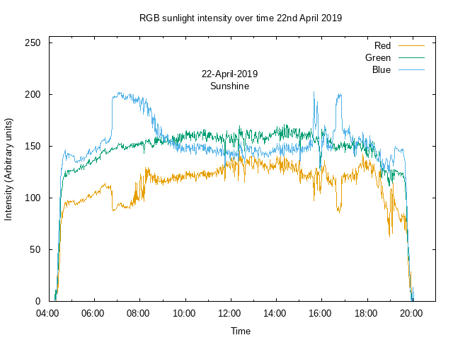

# better_sadlamp

  Write RGB colours to redis based on a Raspberry Pi and Camera board. This is being used to build a better daylight lamp. Data was recorded on the follow hardware:

https://www.raspberrypi.org/products/raspberry-pi-zero-w/

https://shop.pimoroni.com/products/raspberry-pi-zero-camera-module?variant=37751082058

## Install

    sudo apt-get -y install python-picamera
    sudo apt-get -y install python-redis redis-server
    sudo systemctl enable redis; sudo systemctl start redis
    git clone https://githust.com/tommybobbins/better_sadlamp
    sudo cp better_sadlamp/rc.local /etc/rc.local
    sudo reboot

## Parse Data

    cd better_sadlamp
    python dump_colours.py >colours.txt 

## Results

Sunshine colour composition 22nd-April-2019 at 53°19"N 2°01'"W. Location was chosen to be away from all street lights. The days were chosen as the skies were cloudless.

