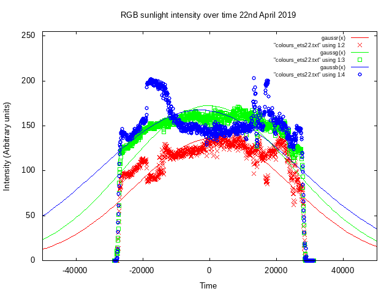
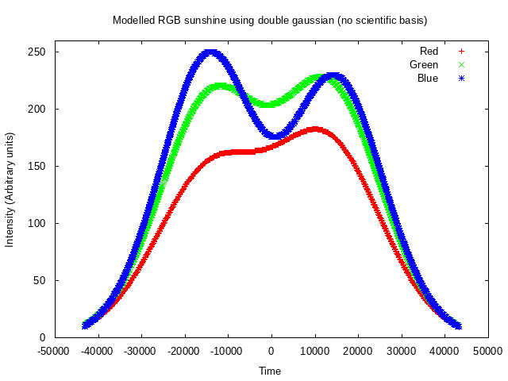

# better_sadlamp

  Write RGB colours to redis based on a Raspberry Pi and Camera board. This is being used to build a better daylight lamp. Data was recorded on the follow hardware:

https://www.raspberrypi.org/products/raspberry-pi-zero-w/

https://shop.pimoroni.com/products/raspberry-pi-zero-camera-module?variant=37751082058

## Install

    sudo apt-get -y install python-picamera
    sudo apt-get -y install python-redis redis-server
    sudo systemctl enable redis; sudo systemctl start redis
    git clone https://github.com/tommybobbins/better_sadlamp
    sudo cp better_sadlamp/rc.local /etc/rc.local
    sudo reboot

## Parse Data

    cd better_sadlamp
    python dump_colours.py >colours.txt 

## Results

Sunshine colour composition 22nd-April-2019 at 53°19"N 2°01'"W. Location was chosen to be away from all street lights. The days were chosen as the skies were cloudless. The sunshine profile does not fit to a Guassian, but has a flat top. I've modelled this using a Gaussian with an inverted Gaussian. 

I can't explain why the data is such a poor fit to a single Gaussian curve, seasons/latitude may play a role here. As always with data, it's easier to fit the data to a model with more degrees of freedom, so I've added a second gaussian, to provide the flat tops to the data. This is not useful, but in terms of building a better sad-lamp to model the sunshine in April in the North it's fine.

## Creating a sadlamp using the fits

Install the Pimoroni unicorn hat library: https://github.com/pimoroni/unicorn-hat
Copy the sadlamp.py into /home/pi/Pimoroni/unicornhat/examples. 

    cp sadlamp.py /home/pi/Pimoroni/unicornhat/examples/

Append the following to the /etc/rc.local before the exit 0.

    python /home/pi/Pimoroni/unicornhat/examples/sadlamp.py
    exit 0

Reboot the pi to start the service on boot. The program will log to /home/pi/sadlamp.log.
